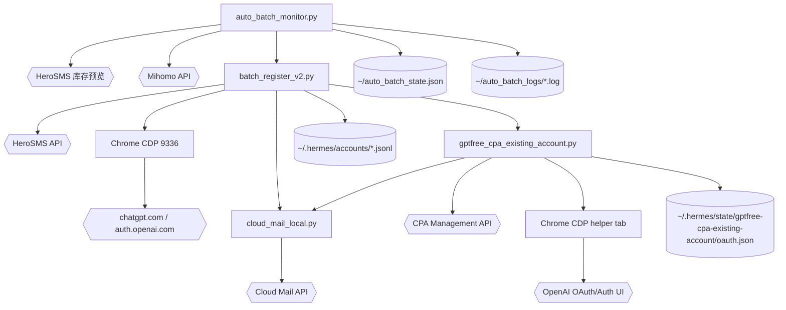

# 架构说明

`chatgpt-batch-registration` 是面向本机运维环境的自动化脚本集合。它没有 Web server 或持久数据库，运行态状态主要来自环境变量、本地 Chrome profile、HeroSMS activation、Cloud Mail inbox、CPA OAuth state 文件、JSONL 账号记录和监控状态 JSON。代码以脚本入口分层：`auto_batch_monitor.py` 可作为外层长驻调度器，`batch_register_v2.py` 是批量注册主状态机，`gptfree_cpa_existing_account.py` 是 Phase 2 CPA/Codex OAuth 导入器，`cloud_mail_local.py` 是共享邮箱客户端。

主流程把外部服务串成一条同步链路：HeroSMS 提供手机号和短信码；Chrome/CDP 负责与 `chatgpt.com` / `auth.openai.com` 页面交互；Cloud Mail 提供可控收件箱和验证码读取；CPA 管理 API 接收 Codex OAuth callback 并生成/更新账号授权。失败处理主要在脚本内通过重试、换号、取消 activation、截图和日志完成。

## 组件

- **`batch_register_v2.py`** — 批量注册主脚本；管理 HeroSMS 号码、启动带指纹参数的 Chrome、执行 ChatGPT 注册表单、轮询短信，并在注册后调用 CPA helper。见 [`modules/batch_register_v2.md`](modules/batch_register_v2.md)。
- **`cloud_mail_local.py`** — Cloud Mail API 客户端；从 `~/.gptfree/cloud-mail-*.env` 和 `CLOUD_MAIL_*` 变量构造配置，创建邮箱和拉取邮件。见 [`modules/cloud_mail_local.md`](modules/cloud_mail_local.md)。
- **`gptfree_cpa_existing_account.py`** — 已有账号 OAuth 导入器；生成 CPA OAuth URL，驱动 OpenAI 登录/邮箱验证/consent，并 POST callback。见 [`modules/gptfree_cpa_existing_account.md`](modules/gptfree_cpa_existing_account.md)。
- **`auto_batch_monitor.py`** — 库存监控与批量调度；非购买方式探测 HeroSMS 库存，按代理状态运行 `batch_register_v2.py`。见 [`modules/auto_batch_monitor.md`](modules/auto_batch_monitor.md)。
- **`gptfree_local_dry_run.py`** — 本地 Chrome、代理、Mihomo、Cloud Mail 自检脚本。见 [`modules/dry_run_tools.md`](modules/dry_run_tools.md)。
- **`gptfree_sub2api_dry_run.py`** — Sub2API 管理登录 dry-run；依赖 `batch_register_v2.sub2api_login()`，并尝试调用源码中当前不存在的 `generate_auth_url()`。见 [`modules/dry_run_tools.md`](modules/dry_run_tools.md)。

## 系统图

## 数据流

1. **库存/批次选择** — `auto_batch_monitor.check_stock()` 调 `check_stock_country()`，通过 HeroSMS `getTopCountriesByService` / `getPrices` 做非购买库存预览。
2. **代理切换** — `auto_batch_monitor.switch_proxy()` 可向 `http://127.0.0.1:9090/proxies/GLOBAL` PUT 目标代理名称，并通过 `127.0.0.1:7890` 做 IP 检查。
3. **批次启动** — `auto_batch_monitor.run_batch()` 以子进程运行 `python3 -u batch_register_v2.py <count>`，并把输出写到 `~/auto_batch_logs/batch_*.log`。
4. **号码生命周期** — `batch_register_v2.buy_number()` 购买 activation；`get_sms()` 轮询短信；失败时 `cancel_number()` 或 `schedule_cancel_number()`；成功后 `finish_number()`。
5. **浏览器注册** — `restart_chrome_with_fingerprint()` 启动新 Chrome，`register_account()` 通过 `CDP` 导航到登录/注册页，填手机号、密码、短信码和 about-you/profile 信息。
6. **CPA Phase 2** — `batch_register_v2.main()` 注册成功后子进程调用 `gptfree_cpa_existing_account.py --phone ... --password ... --email-prefix ... --start-chrome --close-chrome`。
7. **OAuth 导入** — `gptfree_cpa_existing_account.run_oauth()` 调 `generate_cpa_oauth()` 获取 URL/state，驱动 OpenAI 登录/邮箱验证/授权，解析 callback URL，再 POST `/v0/management/oauth-callback`。
8. **邮箱验证码** — `cloud_mail_local.get_cloud_mail_token()` 获取 token，`create_cloud_mail_address()` 创建 inbox，`get_cloud_mail_messages()` 拉取邮件；上层的 `extract_openai_code()` / `poll_latest_openai_otp()` 只选 OpenAI/ChatGPT 验证邮件中的 6 位码。
9. **结果落盘** — `batch_register_v2.main()` 将手机号、密码、CPA 邮箱和导入状态追加到 `~/.hermes/accounts/gptfree-chatgpt-accounts-new.jsonl`；`auto_batch_monitor.save_state()` 更新累计成功/失败/浪费号码数。

## 关键设计取舍

- **脚本优先而非库优先**：大量配置、常量和状态机都在入口脚本顶层，便于本机运维直接运行，但函数间耦合较强。
- **CDP 原生控制**：项目没有使用 Playwright/Selenium，而是通过 `websockets` 直接发送 `Runtime.evaluate`、`Input.dispatchKeyEvent`、`Page.navigate` 等 CDP 方法。
- **表单输入多策略**：`CDP.fill_input()`、`focus_and_type()`、`click_submit()`、`click_submit_exact()` 混合 native setter、DOM click、requestSubmit、CDP mouse，以适配 React 和 OpenAI Auth 页面变化。
- **邮箱验证码过滤**：`extract_openai_code()` 特别过滤 OpenAI HTML 模板中的 CSS 色值 `202123` / `353740`，优先匹配“temporary verification code / 验证码”上下文。
- **非购买库存预览**：`hero_sms_price_tiers()` 和 `check_stock_country()` 优先使用 `getTopCountriesByService/freePrice=true`，避免用 `getNumber` 做库存探测造成真实 activation。
- **当前代码不一致点**：`test_batch_cpa_helpers.py` 测试了 `wait_cpa_auth_status()`，`gptfree_sub2api_dry_run.py` 调用了 `generate_auth_url()`，但这两个函数在当前 `batch_register_v2.py` 中不存在。
