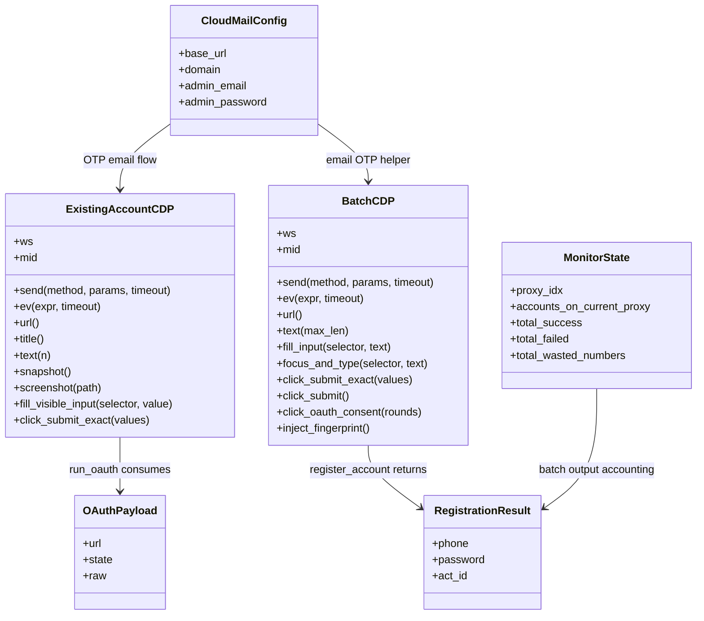

# Class Diagram

## 核心类型

当前项目只有两个显式类，且都叫 `CDP`：分别定义在 `batch_register_v2.py` 与 `gptfree_cpa_existing_account.py`。其他“类型”主要是函数返回的 dict 结构：Cloud Mail config、CPA OAuth payload、注册结果、监控 state。

## Notes

- Mermaid 中的 `BatchCDP` 对应源码 `batch_register_v2.CDP`；`ExistingAccountCDP` 对应源码 `gptfree_cpa_existing_account.CDP`。
- `CloudMailConfig` 不是 Python class，而是 `cloud_mail_local.get_cloud_mail_config()` 返回的 dict。
- `OAuthPayload` 不是 Python class，而是 `gptfree_cpa_existing_account.generate_cpa_oauth()` 返回的 dict。
- `RegistrationResult` 不是 Python class，而是 `batch_register_v2.register_account()` 成功返回的 dict。
- `MonitorState` 不是 Python class，而是 `auto_batch_monitor.load_state()` / `save_state()` 读写的 JSON dict。
