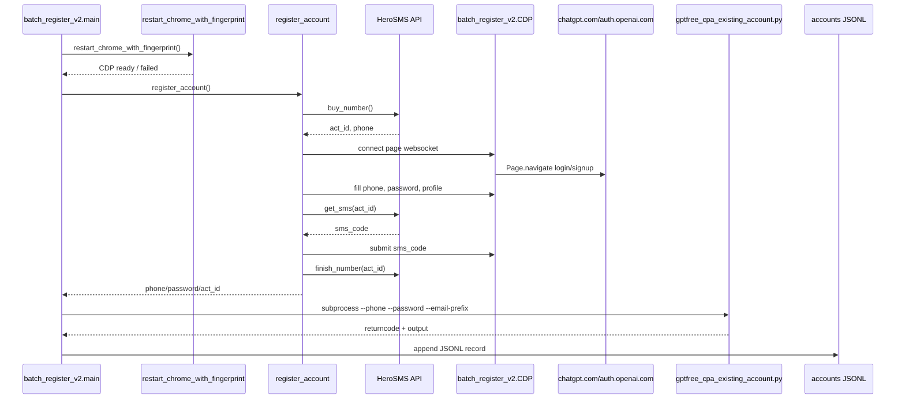
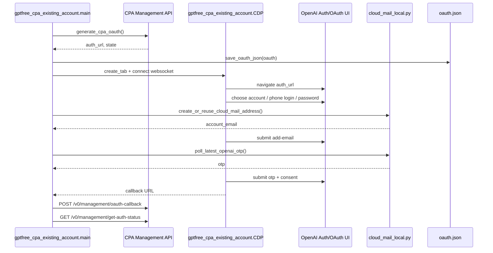
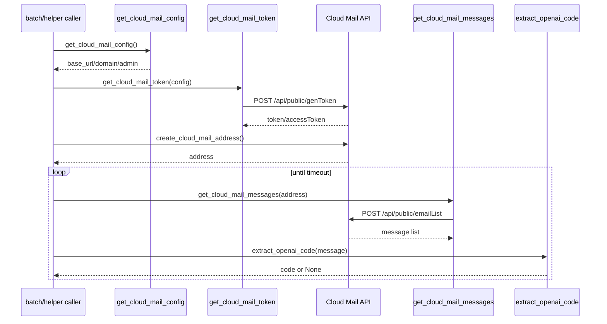
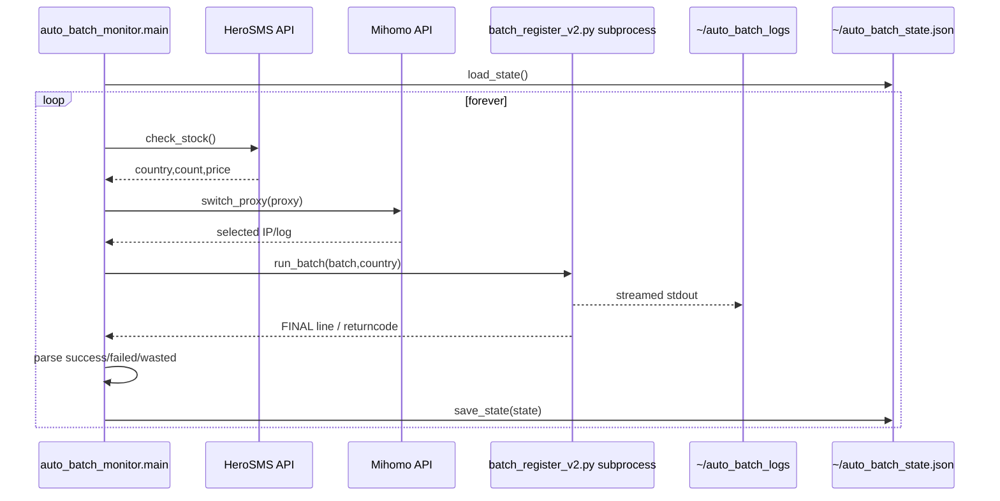

# Sequence Diagrams

## Workflow: 批量注册一个账号并调用 CPA helper

`batch_register_v2.main()` 对每个目标账号重启 Chrome、执行 `register_account()`，注册成功后以子进程调用 `gptfree_cpa_existing_account.py`。

### Walkthrough

1. **批次循环** — `batch_register_v2.main()` 从 `_args.count` 读取目标数量。
2. **Chrome 刷新** — `restart_chrome_with_fingerprint()` 删除旧 profile 并启动 CDP Chrome。
3. **号码购买** — `register_account()` 调 `buy_number()` 获取 HeroSMS activation。
4. **页面注册** — `CDP` 通过 `Page.navigate`、`Runtime.evaluate`、`Input.dispatchKeyEvent` 操作 ChatGPT/Auth 页面。
5. **短信验证** — `get_sms()` 轮询 HeroSMS `getStatus`，收到码后提交。
6. **Phase 2 导入** — 注册成功后 `main()` 用 `subprocess.run()` 调 `gptfree_cpa_existing_account.py`。
7. **结果记录** — 按 helper returncode/output 判断 `oauth_imported` 并写 JSONL。

## Workflow: 已有账号 CPA/Codex OAuth 导入

`gptfree_cpa_existing_account.run_oauth()` 获取 CPA OAuth state，打开 OpenAI 授权页，处理登录、邮箱验证码和 consent，最后回传 callback。

### Walkthrough

1. **OAuth URL** — `generate_cpa_oauth()` 调 CPA `/v0/management/codex-auth-url`。
2. **state 保存** — `save_oauth_json()` 写入 `DEFAULT_STATE_DIR/oauth.json`。
3. **浏览器会话** — `create_tab()` 创建新 tab，`CDP.send()` 启用 Page/Runtime/Network。
4. **登录路径** — `run_oauth()` 根据页面 URL/text 调 `click_account_card()`、`fill_visible_input()`、`click_submit_exact()`。
5. **邮箱验证码** — add-email 或 email-verification 页面触发 `poll_latest_openai_otp()`。
6. **callback 处理** — `callback_parts()` 解析 code/state，`cpa_request()` POST callback 并查询 status。

## Workflow: Cloud Mail 创建邮箱并拉取验证码

Cloud Mail 基础客户端在 `cloud_mail_local.py` 中；上层 OpenAI OTP 筛选在 `batch_register_v2.py` 和 `gptfree_cpa_existing_account.py` 中各自实现。

### Walkthrough

1. **配置读取** — `get_cloud_mail_config()` 合并本地 env 文件和 `CLOUD_MAIL_*` 环境变量。
2. **鉴权** — `get_cloud_mail_token()` 调 `/api/public/genToken`。
3. **创建地址** — `create_cloud_mail_address()` 调 `/api/public/addUser`。
4. **邮件轮询** — `get_cloud_mail_messages()` 调 `/api/public/emailList`。
5. **OpenAI OTP 解析** — 上层 `extract_openai_code()` 先检查 OpenAI/ChatGPT/verification 上下文，再返回 6 位码。

## Workflow: 库存监控触发批量注册

`auto_batch_monitor.main()` 无限循环，按库存、代理和批次结果更新状态。

### Walkthrough

1. **状态加载** — `load_state()` 读取代理索引和累计统计。
2. **库存预览** — `check_stock_country()` 通过非购买接口读取 HeroSMS 可用价格档。
3. **代理切换** — `switch_proxy()` 对非 direct 代理调用 Mihomo `GLOBAL`。
4. **批次执行** — `run_batch()` 子进程启动 `batch_register_v2.py` 并实时写日志。
5. **失败控制** — 如果 `wasted > 0`，`main()` 停止循环。
